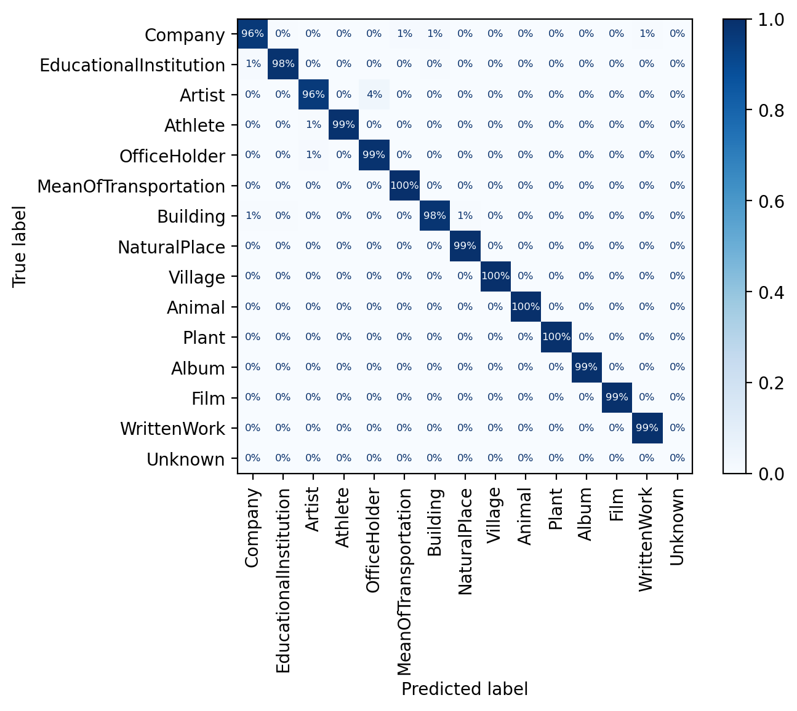

Supercharging LLM's ability to detect patterns
==============================================

# Spoilers

In this blog post, I'll show you how to use LLMs' monstrous pattern recognition ability to achieve unprecedented accuracy on text classification tasks.

# The Problem

# Why fine-tuning?

Fine-tuned LLMs are far more effective at text classification tasks.

- Accuracy
- Training time
- Hardware requirements

<table width='100%'>
    <caption style="caption-side: bottom">Accuracy comparison of fine-tuning and prompt engineering.</caption>
    <td valign="top", width='50%'>
        
<strong>Prompt Engineering</strong>

        
    </td>
    <td valign="top", width='50%'>
        
<strong>Fine-tuning</strong>

        
    </td>
</table>

# How do you do it?

# Applications

# Feedback