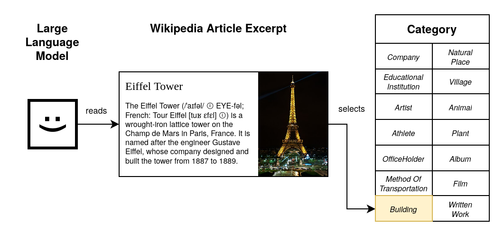

Supercharging LLM's ability to detect patterns
==============================================

# Spoilers

In this blog post, I'll show you how to use LLMs' monstrous pattern recognition ability to achieve unprecedented accuracy on text classification tasks.

# The Problem

Let's imagine we need to classify Wikipedia articles into 14 categories.

Doing this manually would take forever, so we're going to use a large language model (LLM) to automate the process.

The LLM can read the short description of each article and decide on a category for each.

_more detailed description about how this works, why we should consider fine-tuning as an option_

# Why fine-tuning?

Fine-tuned LLMs are better at text classification.
They are more accurate, faster at inference, and are very lightweight. 

### Accuracy

<table width='100%'>
    <caption style="caption-side: bottom; padding-top: 2em">Accuracy comparison of fine-tuning and prompt engineering.</caption>
    <td valign="top", width='50%'>
        
<strong>Fine-tuning</strong>

        
    </td>
    <td valign="top", width='50%'>
        
<strong>Prompt Engineering</strong>

        
    </td>
</table>

### Training time
### Inference speed
### Hardware requirements

# How do you do it?

_short description of the fine-tuning method with code snippets_

# Applications

_short description of the applications of this technique_

# Feedback

_short section requesting feedback from the reader_